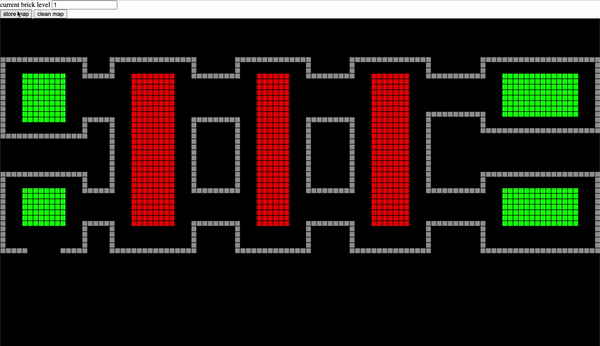

# h5 game

仿哔哩哔哩游戏视频
<https://www.bilibili.com/video/BV1Mv411K7sJ/?spm_id_from=333.788.recommend_more_video.3>

1. open [Map Edit](https://lively-buttercream-5ddce4.netlify.app/breakoutpc/mapCreate.html)

2. click clean map to remove default map data

3. input current bricks level

4. mouse down in map

5. draw graphics of bricks

6. click **store map** button, to store current map data in local storage

7. open [PC Play](https://lively-buttercream-5ddce4.netlify.app/breakoutpc/index.html), to play the game with the map which create by you just now.
